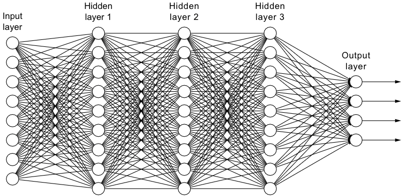

# Building and understanding a neural network from scratch

The purpose of this project is to gain a strong foundation on Neural Networks (NN), a very powerful algorithm. By coding Neural Networks from scratch, a better understanding of the intricacies of NN will be gained. High level API such as TensorFlow and PyTorch will then be easily understood when needed to be use and further research to improve established frameworks can be made.

NN algorithms became heavily popularised for computer vision application after the 2012 ImageNet Competition where Geoffrey Hinton, Ilya Sutskever, and Alex Krizhevsky from the University of Toronto submitted a deep convolutional neural network(CNN) architecture called AlexNet which achieved a winning top-5 test error rate of 15.3% compared to 26.2% achieved by the second-best entry,[Paper](https://papers.nips.cc/paper/4824-imagenet-classification-with-deep-convolutional-neural-networks.pdf). CNN is a variation of a NN model, the underlying concepts of NN is the same as to CNN. Thus, it is vital to understand how does a NN work. There is huge variety of types of neural network model, read more [here](https://www.digitalvidya.com/blog/types-of-neural-networks/). 

In this document, I will try my best to run through every part of NN and also point you to the implementation in Python.Reference to code will given, strongly advise to open up `NN_scratch.py` as you are going through the explanations. Explanations are given in the perspective of getting an overall understanding and not fussing too much about the matrices and vectors you need to set up to deal with the entire neural network and training samples. On the other hand, the implementation in code gives you an idea on how to expand the logic explained to incorporate every part of the neural network through simple linear alegbra. Expected knowledge in linear algebra and NumPy is required.

I hope that by the end of it, the underlying concepts of neural networks will be made clear.

## Introduction to Neural Network (NN)

The human brain consists of billions of interconnected neurons receiving and transmitting information, providing us with the capability to deal with complex and demanding tasks. Artificial Neural Network (ANN) was developed to emulate the learning abilities of biological neurons system. The learning abilities of ANN made it a useful solution for a variety of complex problems such as facial recognition, speech recognition, image classification, machine translation which are used to be tasks that only humans can do but made possible for a machine by utilising ANN. The main question for ANN is how does it learn to solve these tasks? In order to understand that, we will need to first look at the overall architecture of the network and understand the functions used within the network.

## Neural Network Architecture

As shown in the image, the NN architecture consists of the **input, hidden and output layers**. All of these layers consist of multiple nodes which are connected to other nodes (refer `line 270` for set up). Each node will consist of a numeric value. Note that each layer for NN is a 1D vector of nodes so any 2D and above data will be required to be flattened/reshape into the 1D space of numbers to be fed into the NN. The amount of nodes in the input layer follows the size of the input data. Hidden layers are the layers connecting the input layer to the output layer. We have the flexibility to choose as many hidden layers as we want and vary the number of nodes in each hidden layers as we see fit (edit `line 270`). The output layer node/nodes consist of values which we will use to compare to the ground truth of our data for learning. This section provided you with more questions than answers about NN which is intended. Let's keep going by asking questions!

### How are the nodes connected (what are the black lines)?

A node is connected to another node by a very simple and familiar linear equation (Y = MX + C). In the case of NN, the notations for the equation is **Z = Wx + b**  where  Z = Output, W= Weights, x=Input, b= Bias. Value of the node is multiplied by the weight value and then added with the bias value to produce an output value (Z) to be used for the connecting node.

An issue with just using this equation (Z = Wx+b) is that it is only a linear equation which means that the NN is unable to learn non-linear representation. NN is appealing in the first place because of the ability to approximate most continuous function accurately. A feedforward NN with even a single hidden layer containing a finite number of nodes and arbitrary activation function are universal approximators according to the universal approximation theorem. However, this is only possible if there are non-linear mappings within our neural network.

To resolve this issue of needing non-linearity, we will take the node output value (Z) and put it into an **activation function** which gives us A = f(Z) for A is the output value from the activation function (f). An activation function provides a non-linear mapping from input value to output (refer `line 61-80`). Note that in the code it is `Z = np.dot(W,A_prev) + b` and `A = sigmoid(Z)`, this is very important as `W`,`A_prev` and `b` is actually in the form of matrices taking into account **all of the nodes and its connection**. `A_prev` in the case of the first connection is the inputs. Further explanation will be given in the next section about initialization.

There are many activation functions that we can look into but let's put our focus on the two popular activation functions which are Sigmoid and ReLu functions (refer `line 67-73` to see the equation in code):

Given that our activation is A = f(Z), the value of the linear output (Z) is feed into the activation function f to produces the **final value of the connecting node (A)**. Example for usage of Sigmoid activation function, subbing Z in will give A = 1/(1+e^-(Wx+b)).

I found a very helpful visualization to aid the explanation, credits to the [author](https://towardsdatascience.com/forward-propagation-in-neural-networks-simplified-math-and-code-version-bbcfef6f9250):

*Note: Notations of visualization differs from this document,  a1-a2-a3.. is notated as Z here while h1-h2-h3... is notated as A.

A network that computes values from one node to the next node in another layer in only a forward direction is called a **Feedforward Network**. The process of computing f(Wx+b) is known as **Forward propagation** as values are computed and propagated forward to reach the output node/nodes.

### Initialization of W and b values  (Before forward propagation) 

W and b values must be initialized or else there will be no values to propagate along the NN in the first run. With the appropriate initialization, the neural network can be trained quicker. If any constant initialization scheme is used, it will lead the nodes to learn the same features during training as all of the nodes will have an identical influence on the loss function. For example, forward propagating an input layer with 3 nodes (x1,x2,x3) and the connecting node (output) value is f(Wx1, Wx2, Wx3) where all weights (W) are of the same value and biases is 0. The identical influence of the parameters leads to the identical gradient (see gradient descent section). Thus, all nodes connecting to the next layer will evolve symmetrically throughout the training process which prevents different nodes from learning different things. You will get a better understanding of this after reading the gradient descent section.

Initialising weights with values too small will lead to slow learning, taking a lot of epochs("runs") before the convergence of the loss function (problem: [vanishing gradients](https://towardsdatascience.com/the-vanishing-gradient-problem-69bf08b15484)). However, initialising the weights with values too large and it may end diverging away, the loss function is unable to converge to a local/global minimum (problem: [exploding gradients](https://machinelearningmastery.com/exploding-gradients-in-neural-networks/)).

Please stop reading and try it for yourself [here](https://www.deeplearning.ai/ai-notes/initialization/), this article provides a great GUI to aid understanding. 

The values for the weights (W) and biases (b) of the connections can be initialized via the Xavier Initialization Method to provide with appropriate initial values for efficient training. 

Rules of thumbs to follow to prevent exploding or vanishing gradients due to initialization: a) The mean of the activations should be zero. b) The variance of the activations should stay the same across every layer.

In Xavier Initialization, every weight of the layers are picked randomly from a normal distribution with mean = 0 and variance = 1/n for n is the number of nodes in the previous layer. The biases are initialized with zeros. Looking back at the architecture of NN, we can see that each node of a previous layer is connected to **all** nodes of the next layer (refer `line 17-31` ).

`np.random.randn(layers_dims[i], layers_dims[i-1])` is basically setting up the matrix in such a way that fulfils this concept where the rows are the number of next layer nodes and the columns are the number of previous layer nodes. Example: If my input layer has 1024 nodes and the next layer has 50 nodes, it will come out to be `np.random.randn(50, 1024)`. This will work out with how we set up the size of the input to be `(number of features, number of samples)`. For example, feeding in 10000 of 32x32 images will give us 1024 features (flatten) for each image which means our input will be of size `(1024,10000)`. We can check that matrix multiplication is feasible, (`(50,1024) x (1024,10000)`), recalling the rule stating that the column size of the 1st matrix (W) must match the row size of the 2nd matrix (A) for matrix multiplication (W * A). Refer to `line 63` for the code. The very elegant thing about doing it in the matrix is that we are essentially **forward propagating every single sample in a single computation**. You can think of this as setting up 10000 Neural networks of the same architecture at the same time!

*Quick note: if you do not understand the bias size at `line 29`, remember that python does **broadcasting**.

## Loss Function (How does the NN learn?)

As previously mentioned, the values of the output nodes are compared to the ground truth data which is done through a loss function. The loss function is set up in a way to provide a goal for the network to achieve. The loss function will be optimized according to the set-up of the goal such as getting the output values close to ground truth value (minimising error). In the case of NN, a cross-entropy cost function can be used: 

**Notations: A = predicted output from output nodes , y = ground truth**

Loss Function (L) = - y log (A)  -  (1-y) log (1-A) 

Intuition: 

a) If y = 1, L = -log(A)     (**Higher A, produces lower error value. Higher A indicates it is getting closer to 1 (ground truth)**)
b) If y = 0, L = -log(1-A)   (**Lower A, produces lower error value. Lower A indicates it is getting closer to 0 (ground truth)**)

Refer to the negative log function graph to cement this intuition:

            
To minimise the loss function, parameters of Weight (W) and Bias(b) of every connection will be changed in search for the global/local minimum of the loss function by a process known as gradient descent. In other words, the error between the output (A) and ground truth (y) is minimized by tuning the parameters of W and b. This is because the value of A is affected by W and b for A = f(Wx+b).

Refer to `line 93` for equation in code. Note that in the code equation we have the term `1/m` for m is the number of samples. This is because we have summed up all the errors from every single neural network (every sample) so `1/m` is a normalizing factor.

## Gradient Descent (How is the cost function minimised?)

Gradient descent is a process where the gradient of the loss function is used to provide the direction and magnitude in search of the local/global minimum. In the context of the NN architecture, the gradient of the weights and biases are computed via **backpropogation** to be used to minimise the loss function.

The updated weights (W_new) and biases (b_new) are obtained by:

1. W_new = W - a*(gradient of W)
1. b_new = b - a*(gradient of b)

a is the learning rate, it is a scalar used to scale the values of the gradient to improve training speed and prevent overshooting the minima point.

Further reading about gradient descent, [here](https://www.kdnuggets.com/2018/06/intuitive-introduction-gradient-descent.html).

Note that there are many ways to improve the process of gradient descent through different optimizations techniques. For example, including information of the past gradients helps to dampens oscillations as the direction of the gradient changes sharply. 

Gradient descent optimization techniques such as RMSprop takes away the need to tune the learning rate by incorporating it in its algorithm. The heuristics for auto-tuning the learning rate is such that when it is heading near the minima, it will decrease the learning rate to prevent overshoots. Further read about optimization techniques, [here](https://blog.paperspace.com/intro-to-optimization-momentum-rmsprop-adam/).

Refer to `line 174 - 182`. 

## Backpropogation (How are the derivatives/gradients computed?)

The goal of backpropagation is to compute the partial derivatives ∂L/∂w and ∂L/∂b of the loss function (L) with respect to any weight w or bias b **throughout the entire network**. Read about partial derivatives over at [wikipedia](https://en.wikipedia.org/wiki/Partial_derivative) if you are not familiar.

If you are using a deep learning framework such as TensorFlow and PyTorch, all of the partial derivatives of the loss function with respect to the weight and bias parameters is computed via a symbolic solver. There is not a need to derive the equations yourself, all you have to do is to set up the activation and loss function.

With that being said, an understanding of the derivation is very interesting to learn and gives you an appreciation for calculus. 

From the loss equation, we can see that L is a function of ground truth (y) and the output node (A), L(y, A). A is the function of Z and Z is a function of W and b as A = f(Z) = f(Wx+b). Thus, there are 4 main partial derivatives to find namely ∂L/∂w,∂L/∂b,∂L/∂A and ∂L/∂Z. The partial derivatives involved are the parameters in the loss function with respect to each parameter individually. 

We will be using chain rule (learn the basic [here](https://www.khanacademy.org/math/ap-calculus-ab/ab-differentiation-2-new/ab-3-1a/v/chain-rule-introduction) if you are not familiar with chain rule) to figure out the partial derivatives **throughout the entire network** by backtracking all of the parameters in the connecting nodes that has contributed to the loss function (L) starting with the final output node value (A). Note that it is throughout the entire network as every connecting nodes have its own weight and bias.

**Check out how to derive the equations used for neural network in context of the code in this <a href="backprop.pdf" target="_blank">PDF written by me.</a>**. Please open the pdf derivations and code together (refer `line 104-146`).

**Fantastic videos to learn the intuition behind backpropagation, [1](https://www.youtube.com/watch?v=Ilg3gGewQ5U) and [2](https://www.youtube.com/watch?v=tIeHLnjs5U8).** Highly recommended to watch!

# Summary

The 5 important parts to building a neural network are:

1. Initilisation of paramaters - Initialising values of weights (W) and biases (b) for efficient training.
2. Forward Propagation -  Propagating the values of nodes from one layer to another by the combination of linear function and non-linear activation functions (A = f(Z), Z = Wx+b where A is the output value, Z is the linear output going into the activation function, W is the weight, x is the input for input nodes) and known as A_previous for nodes of hidden layer, b is bias)
3. Loss Function  - Setting up a loss function to provide an objective to be optimized.
4. Backpropagation - Finding the partial derivatives of the loss function with respect to W and b for gradient descent.
5. Gradient Descent with Optimization - Gradients of W and b is used in gradient descent to tune the parameters W and b to find the minima of the loss function. The process of gradient descent can be optimized with techniques such as momentum and Adam.

**In essence, neural networks are very useful because it is an universal approximator. It consists of many stacks of differentiable non-linear functions with lots of parameters that can nearly approximate any continuous functions according to the goal set up by the cost function. The neural networks seeks to find a continuous functions (its architecture with specific weights and biases) that can take in an input and predict an output that we want. We change the architecture of neural networks in search of a continuous function that can give us the best prediction based on the inputs we receive. This is why there are so many variation of neural networks out there, each to tackle different types of input data to provide the best prediction possible.**

# Extras (Great learning resources and things worth reading)

1. Interesting example on the importance of hidden layers to approximate the functions governing the logic of XOR gate, [HERE](https://medium.com/@jayeshbahire/the-xor-problem-in-neural-networks-50006411840b). This also provides insight on why we will want to make the layer deeper sometimes to better approximate representation(continuous functions).
2. Deep Learning Specialization by deeplearning.ai on Coursera, [HERE]().
3. FastAI Lectures Series, [HERE](https://course.fast.ai/)
4. Interesting read on ImageNet, [HERE](https://qz.com/1034972/the-data-that-changed-the-direction-of-ai-research-and-possibly-the-world/)
5. Read more about Backpropgation Algorithm,[HERE](http://neuralnetworksanddeeplearning.com/chap2.html)
6. Read more about approximation in this paper, [HERE](http://citeseerx.ist.psu.edu/viewdoc/download?doi=10.1.1.101.2647&rep=rep1&type=pdf).

# Let's use it!

Head over [**HERE**](https://github.com/timothylimyl/image_classifier) where I used the neural network we just learn about and implemented it to classify my favourite noodles!

Other neural network related projects that I have completed:
1. [Behavioral Cloning](https://github.com/timothylimyl/self_driving_cloning)
2. [Benchmarking against Fashion MNIST](https://github.com/timothylimyl/FASHION-MNIST)

